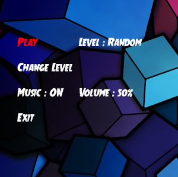
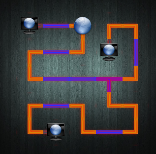

# The Menu

- Up/Down arrow to navigate different options
- Press Enter for Play/Exit
- On Change Level you can also use left/right arrow to select level other than Enter
- On Music,press Enter to toggle on/off and left/right arrow to adjust volume

# Playing the game

- Left mouse click on any connector,it will rotate it.
- Find the orientation for all the connectors such that all the clients are connected to the server

This is how a solved game looks like

The background music and images are not hardcoded in the binary you can swap them out from images,sound folder

